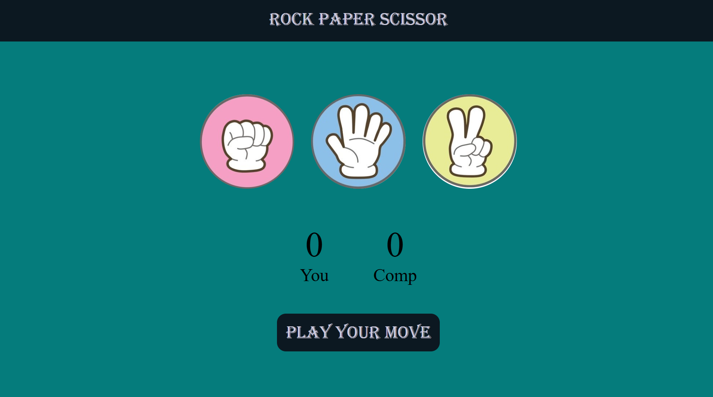
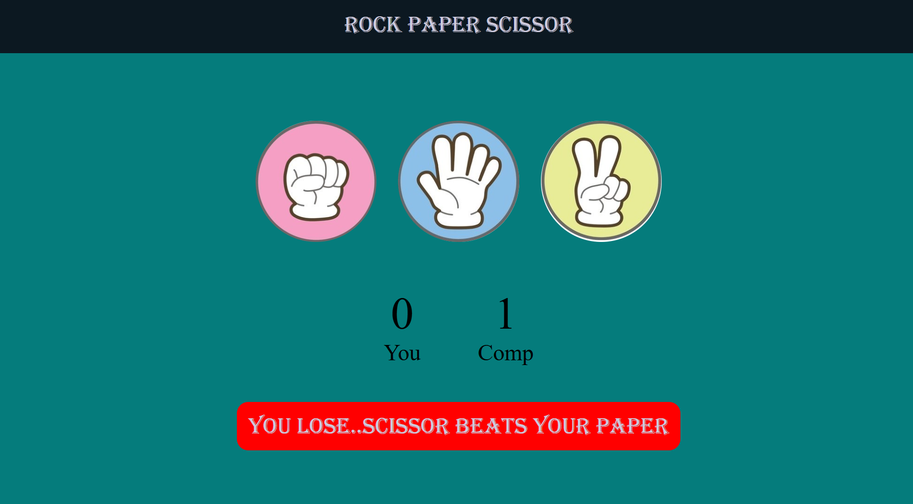
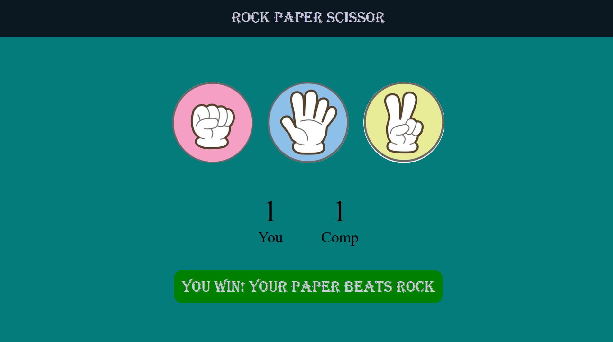
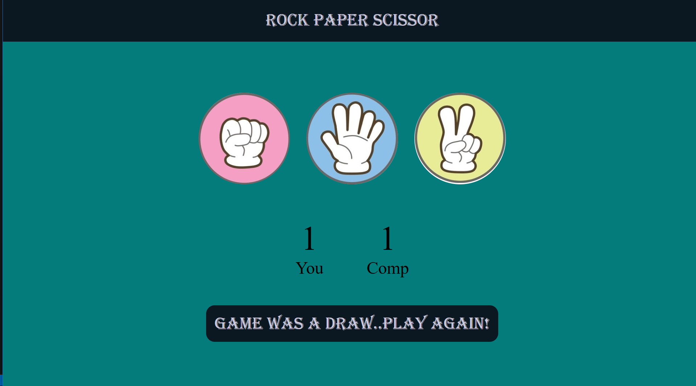
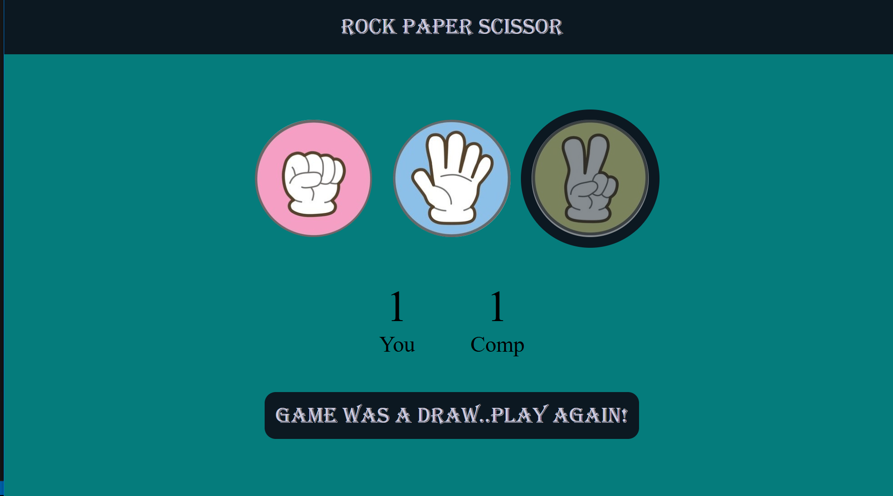

# Welcome to the Rock-Paper-Scissors Game!
This project is simple yet engaging, featuring dynamic gameplay and real-time score tracking.

---

## Purpose
The purpose of this game is to provide an entertaining and interactive digital versions of classic Rock-Paper-Scissors game.It serves as beginner-friendly project for exploring web-development concepts.

---

## Features
- **Interactive Gameplay**: Choose between Rock, Paper or Scissors to compete with the computer.
- **Real-Time Score Tracking**: The scores updates automatically after every round for both user and computer.
- **Hover Effects**: Visual feedback on hover over options for enhanced user experience.
- **Dynamic UI**: Clean and responsive interface for smooth user interaction.
- **Result Display**: Clearly displays the result for round win, lose or draw.

---

## Technologies Used
- **HTML**
- **CSS**
- **JavaScript**

---

## How to Play
1. Clone this repository:
   ```bash
   git clone https://github.com/ShraddhaThakare801/Rock-Paper-Scissor-Game.git  

2.Open index.html file in any browser.  

3.Select Rock, Paper or Scissors and compete against the computer.

4.Watch the score updates in real time and enjoy!

---

## Screenshots
### Game Start Screen:


### User Loses:


### User Wins:


### Game Draw:


### Hovering Effect:


---

## Future Enhancement 
- Add exciting animations for winning or losing rounds.
- Incorporate sound effect for engaging gameplay.
